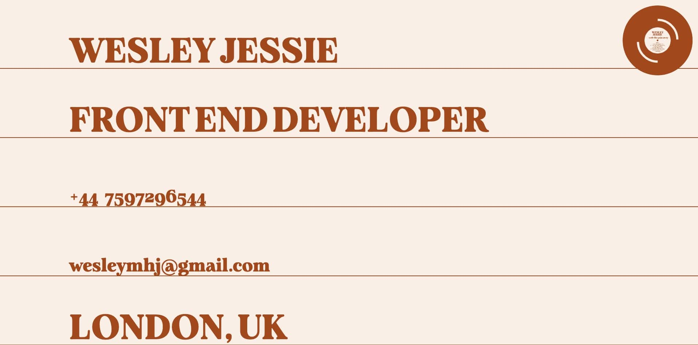
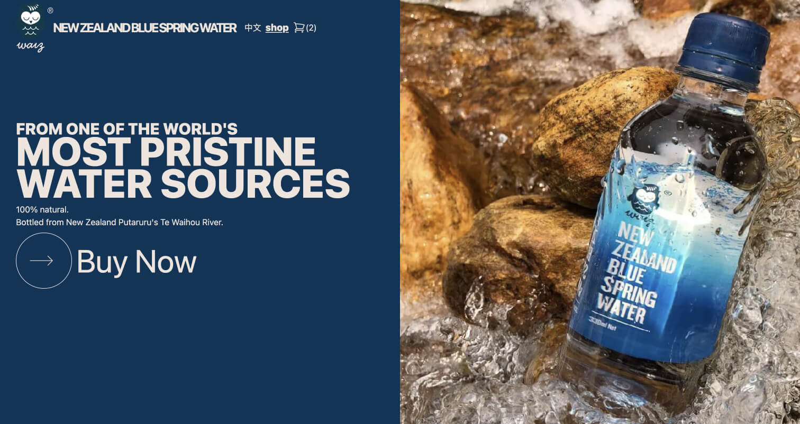
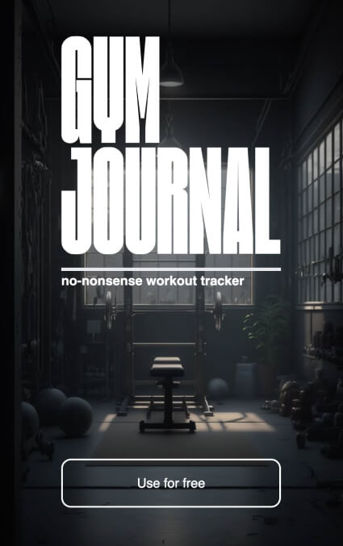

<h1 align="center"><a href="https://www.wesleyjessie.com/">wesleyjessie.com</a></h1>

<h2 align="center">My most recent project:</h2>

E-commerce for New Zealand Blue Spring Water

<a href="https://www.waizwater.com/en-GB">Visit the site</a>

<h2 align="center">Tools I use:</h2>
<ul>
<li>React</li>
<li>Next JS</li>
<li>Typescript</li>
<li>Jest</li>
<li>Cypress.io</li>
<li>Tailwind CSS</li>
<li>React Spring</li>
<li>Firebase</li>
<li>React Router</li>

<li>Python - for data analysis</li>
</ul>

<h2 align="center">My current side project: </h2>

GymJournal.co.uk

<a href="https://gymjournal.co.uk/">Visit the site</a>

